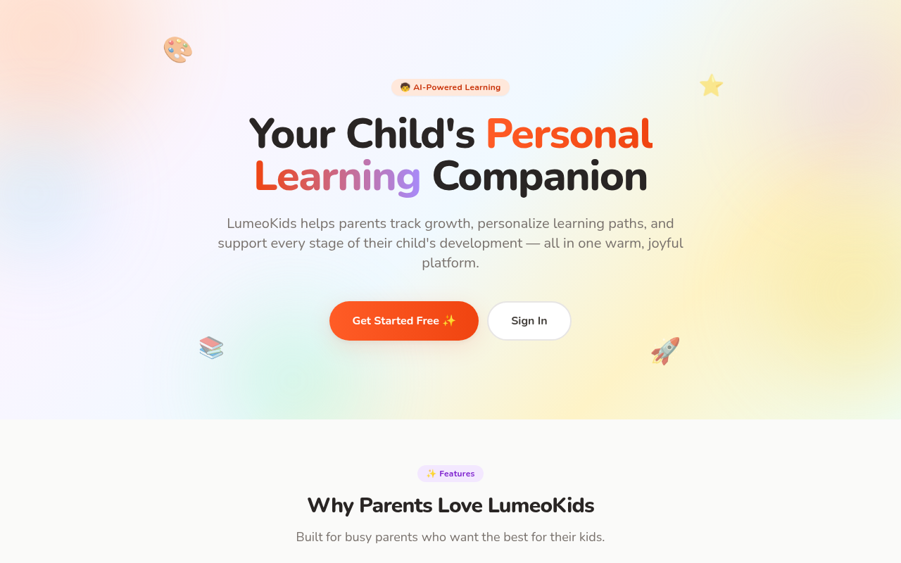
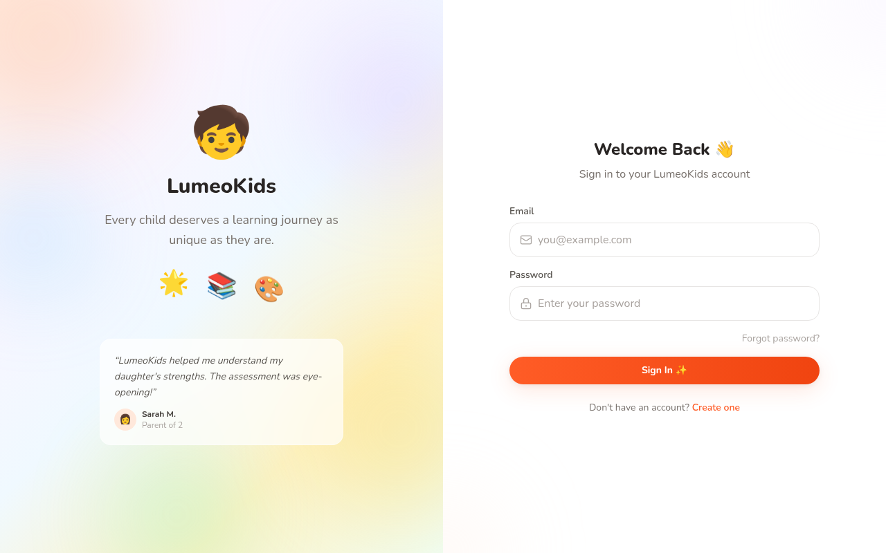
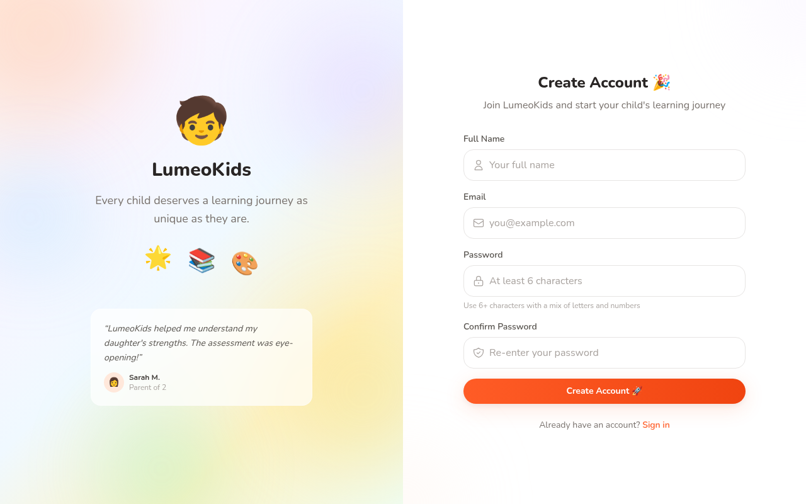
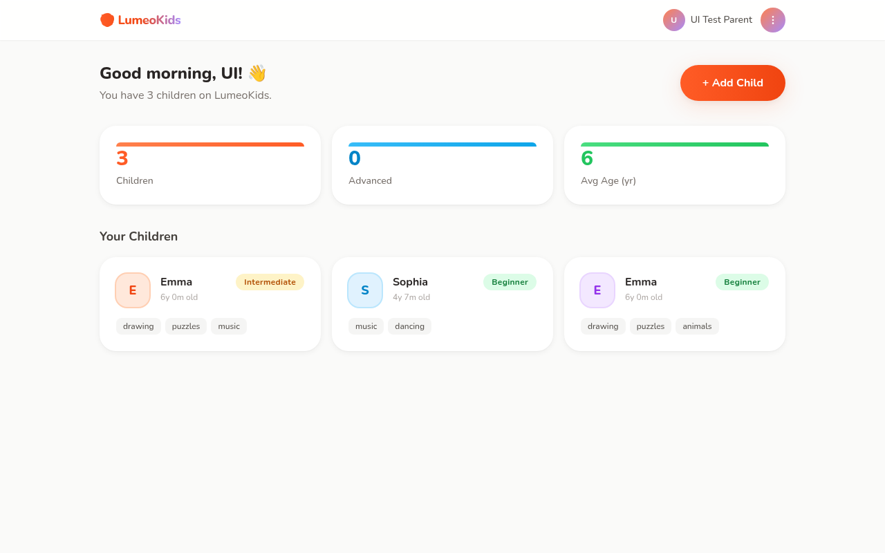
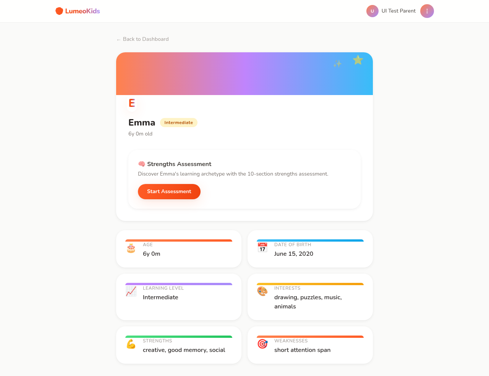
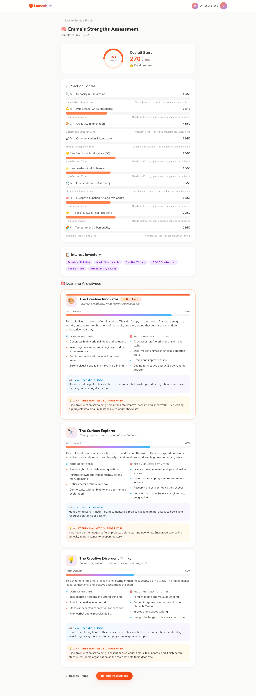

# ch-4 Personal Project — Report

## Project

- **GitHub username:** @royallyre7
- **Repo URL:** https://github.com/royallyre7/lumeokids
- **Live / download URL:** https://github.com/royallyre7/lumeokids/releases/tag/v1.0.0
- **License:** MIT
- **One-line summary:** LumeoKids is an AI-powered learning platform that helps parents create child profiles, discover learning archetypes through strengths assessments, and personalize their child's development journey.

## Product-Intro Slides

- **Slides path:** slides/pitch.md

## Demo Screenshots

- **Resolution used:** 1280×800 desktop

## Notes (optional)

- **How to run:** Clone the repo, run `npm install`, `npx prisma migrate dev`, then `npm run dev`.
- **Test login:** uitest@example.com / password123 (has sample child profiles)
- **Tech stack:** Next.js 14, Tailwind CSS, Prisma/SQLite, NextAuth.js, Zod
- **UI:** Playful Bubbles design system with coral/lavender/sky palette, floating animations, and accessibility support
